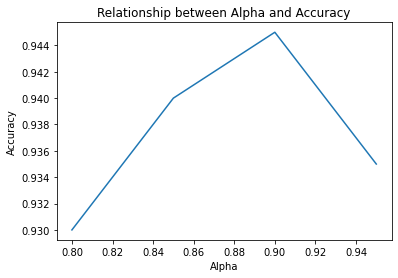
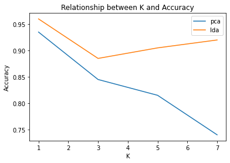
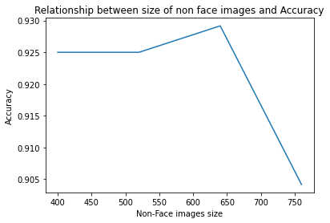
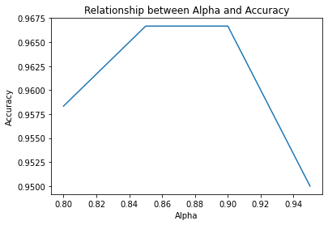
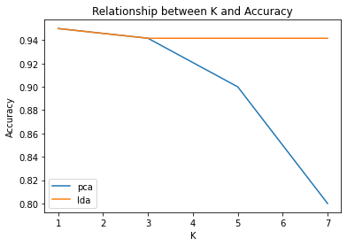
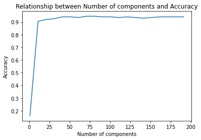

# Face-Recognition

**Objective:**  Perform face recognition for 40 subjects using the ORL dataset, comparing Principal Component Analysis (PCA) and Linear Discriminant Analysis (LDA) approaches.

## ORL Dataset:
The data set contains 40 different subjects each has 10 grayscale images of size 92x112. Images are saved in PGM format (stands for Portable Gray Map) and each pixel has a value between 0 and 255.

## Key Steps:

* **Data Setup:** Convert images to vectors, create data matrix and labels, and split into training/test sets.

* **PCA:** Compute projection matrices at different alpha values, project data, classify with KNN, track accuracy, and alpha relationship.

* **LDA:** Calculate class means, scatter matrices, dominant eigenvectors, and project data, classify with KNN and compare accuracy to PCA.
  
* **Tuning:** Experiment with K values in the KNN classifier for both PCA and LDA and analyze performance impact.

* **Non-Face Recognition:** Include non-face images, train models to distinguish faces, explore success/failure cases, analyze eigenvectors/accuracy trade-off

## Results:

* **Relation between Alpha and Accuracy for PCA:** It increases at first then decreases due to the overfitting problem.

* **Relation between K (number of neighbors) and Accuracy for LDA and PCA:** LDA is not affected too much by the number of neighbors, unlike PCA.

* **Relation between Non-face Sizes and Accuracy:** As there are more samples of the Non-faces, they affect the decision boundary and bias the classification.

* **Relation between Alpha and Accuracy for PCA when increasing the data size:** The accuracy of PCA improved when using more training data..

* **Relation between K (number of neighbors) and Accuracy for LDA and PCA when increasing the data:** LDA is not affected too much by the number of neighbors, unlike PCA.

* **Relation between the number of components and Accuracy for Randomized PCA**

## Comparison of Randomized PCA and Shrinkage LDA

 Feature | Randomized PCA | Shrinkage LDA |
|---|---|---|
| **Dimensionality Reduction** | Random projections | Shrinking class covariance matrices |
| **Dataset Suitability** | Large, potentially sparse | Smaller, potentially limited training data |
| **Computational Cost** | Lower | Moderate |
| **Potential Trade-offs** | Accuracy (approximation) | Accuracy (regularization) |
| **Strengths** | Scalability, speed, sparsity | Improved generalization, overfitting control |

  
